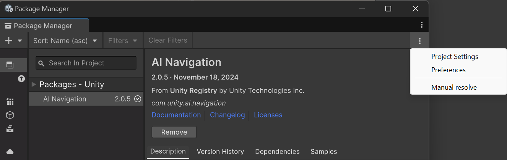
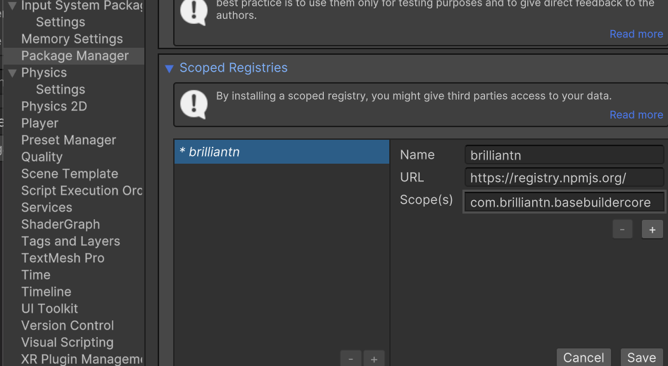
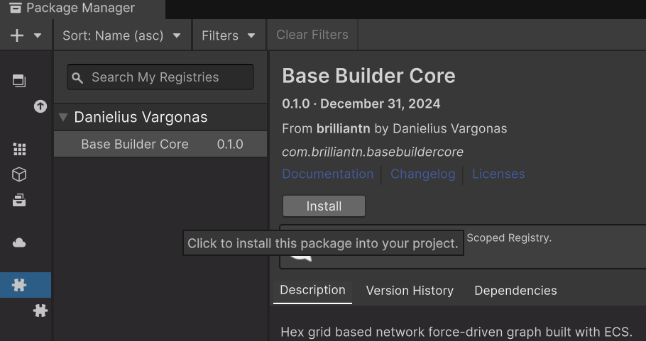

Requirements to run:
- Install Blender
- Tick "Entities" subscene when first starting "BuildSample-ForceDirected"
- Install deps.

Installation instructions (Unity 6):
	- Open Unity Package Manager
	- Add a scoped registry, first open package manager settings:
	
	- Add scoped registry data:
	
	- Go back go Unity Package Manager and select "My Registries" in the side tab strip
	- Select the package and click install. You can chose a particular version if needed.
	
	- Thats it! Enjoy the package. Contributions are welcome.

Dependencies:
- [BovineLabs.Core](https://github.com/tertle/com.bovinelabs.core) (core)
- TextMesh Pro (optional)
- [EditorCools](https://github.com/datsfain/EditorCools/tree/main) (optional)

# To Do - QoL:
[x] Remove Editor Cools code and add as a package dep instead (removed, it is not available as a managed package)
- Add CI/CD on push to release a package
- Improve existing code extensibility
- Add Tests

#To Do - Features (Forces):
- Add global centrific force, to center the graph naturally on zero
- Add centrific force for each hex, for the nodes to eventually settle in a hexagonal pattern
- Add minimum range force, to prevent nodes from overlapping or coming too close each

#To Do - Features (Visuals):
- Add hex-grid based links to visualize node connections in runtime
- Split to transition and stable states, to allow for more complex animations of the links and nodes
